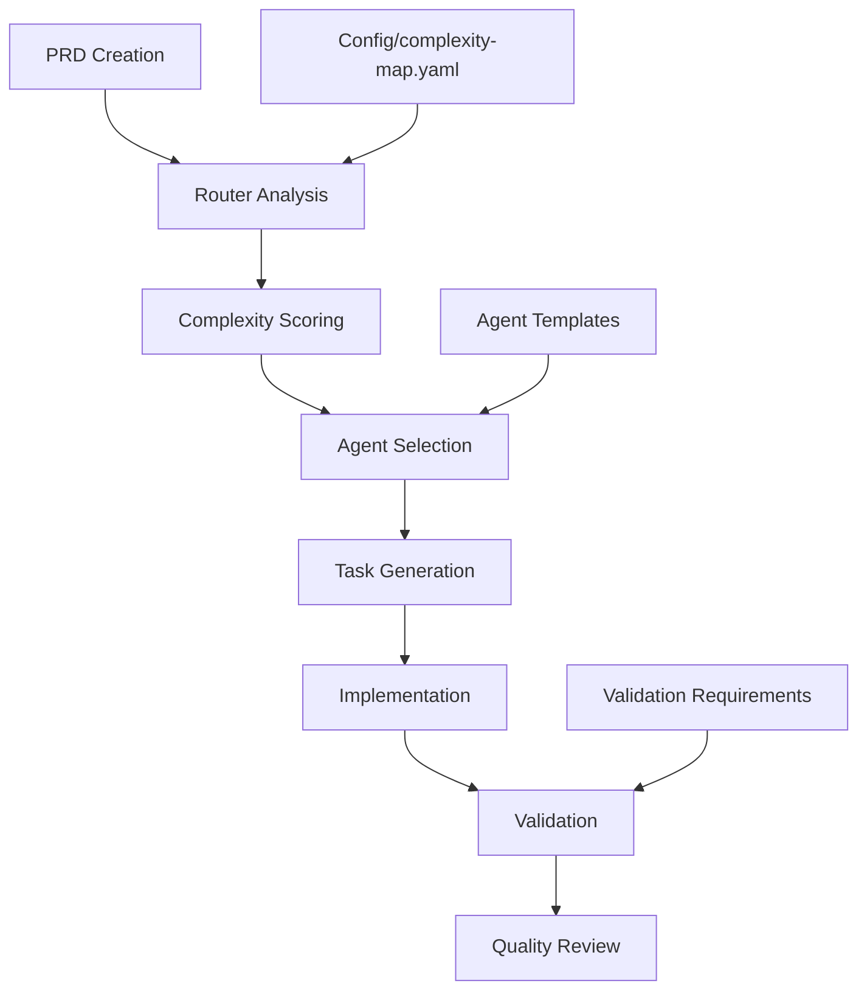

# Complexity Inheritance System

## Overview

The Complexity Inheritance System is a comprehensive framework for automatically determining appropriate complexity levels, selecting suitable agents, and applying validation requirements throughout the software development lifecycle in Claude Code configurations.

## Key Features

- **Automatic Complexity Detection**: Uses objective scoring criteria to determine complexity levels
- **Template-Based Agent Generation**: All agents generated from templates to prevent maintenance drift
- **Centralized Configuration**: Single source of truth for complexity mappings and validation requirements
- **Metadata Inheritance**: Complexity information flows from PRD → spec → tasks → implementation
- **Audit Trail**: Complete logging of all routing decisions and rationale

## Architecture



## Complexity Scoring

The system uses a weighted scoring algorithm based on objective criteria:

### Scoring Formula

```
Score = (blast_radius × 2) + (data_sensitivity × 2) + (backward_compat × 1) + 
        (perf_budget × 1) + (migration × 2) + (external_api_change × 1)
```

### Ordinal Mappings

| Factor | Values | Ordinal Scores |
|--------|--------|----------------|
| blast_radius | file=0, package=1, service=2, org=3 | 0-3 |
| data_sensitivity | none=0, pii=2, regulated=3 | 0-3 |
| perf_budget_ms | ≤100=4, 101-200=3, 201-300=2, >300=1, none=0 | 0-4 |
| backward_compat | false=0, true=2 | 0-2 |
| migration | false=0, true=2 | 0-2 |
| external_api_change | false=0, true=1 | 0-1 |

### Complexity Levels

- **Minimum (0-2 points)**: Simple features with file-level impact
- **Basic (3-4 points)**: Standard features with package-level impact
- **Moderate (5-7 points)**: Production features with service-level impact
- **Complex (8+ points)**: Enterprise features with organization-wide impact

## YAML Front-Matter Schema

All documents use standardized YAML front-matter:

```yaml
---
version: 1
complexity: auto  # or minimum|basic|moderate|complex
agents:
  developer: auto
  reviewer: auto
risk:
  blast_radius: package     # file|package|service|org
  external_api_change: false
  migration: false
nonfunctional:
  perf_budget_ms_p95: 200
  data_sensitivity: none    # none|pii|regulated
  backward_compat_required: false
routing:
  allow_override: true
  override_reason: ""
  computed_score: [router-filled]
  selected_agents: [router-filled]
  audit_trail: [router-filled]
---
```

## Agent Selection

Agents are automatically selected based on complexity level:

| Complexity | Developer Agent | Quality Reviewer Agent |
|------------|----------------|------------------------|
| Minimum | developer-minimum | quality-reviewer-minimum |
| Basic | developer-basic | quality-reviewer-basic |
| Moderate | developer-moderate | quality-reviewer-moderate |
| Complex | developer-complex | quality-reviewer-complex |

All agents are generated from templates to ensure consistency and prevent maintenance drift.

## Validation Requirements

Validation requirements scale with complexity:

### Minimum Level
- Basic linting and build checks
- Secrets scanning
- Prototype-level quality acceptable

### Basic Level  
- Unit tests for core logic
- Integration tests for system behavior
- Dependency security audit
- Production-ready code quality

### Moderate Level
- Comprehensive test coverage (>80%)
- Integration and performance smoke tests
- Basic SAST security scanning
- Enterprise-grade code quality

### Complex Level
- Comprehensive test coverage (>90%)
- End-to-end and performance benchmark tests
- Advanced SAST/DAST security scanning
- SBOM generation for compliance
- Mission-critical code quality

## Usage Guide

### 1. PRD Creation
Use `p:create-prd` command to create PRDs with automatic complexity detection:

```bash
/p:create-prd "User authentication system with OAuth integration"
```

The router will analyze the requirements and assign appropriate complexity level.

### 2. Task Generation
Use `p:gen-tasks` to generate task lists that inherit PRD complexity:

```bash
/p:gen-tasks tasks/prd-user-auth.md
```

Tasks inherit all complexity metadata from the source PRD.

### 3. Implementation
Use `b:process-tasks` for complexity-aware implementation:

```bash  
/b:process-tasks tasks/tasks-prd-user-auth.md
```

The system automatically:
- Selects appropriate developer and quality reviewer agents
- Applies complexity-appropriate validation requirements
- Runs required tests and security scans

### 4. Manual Overrides
You can override router decisions with justification:

```yaml
complexity: minimum  # override to minimum
routing:
  override_reason: "Prototype version for initial user feedback"
```

## Router Command Line Interface

The central router can be used directly:

```bash
# Analyze complexity of a file
python3 scripts/route_complexity.py prd-example.md

# Use strict validation mode
python3 scripts/route_complexity.py --strict prd-example.md

# Get full audit trail
python3 scripts/route_complexity.py --audit-detail full prd-example.md
```

### Router Output
```json
{
  "computed_complexity": {
    "total_score": 7,
    "computed_level": "moderate",
    "dominant_axis": "performance"
  },
  "selected_agents": {
    "developer": "developer-moderate",
    "quality_reviewer": "quality-reviewer-moderate"
  },
  "validation_requirements": {
    "required_checks": ["lint", "build", "secrets_scan", "unit_core", "integration_tests"]
  }
}
```

## Precedence Rules

Metadata resolution follows clear precedence:

1. **task.md** metadata (highest priority)
2. **spec.md** metadata  
3. **prd.md** metadata
4. **repo-config** defaults
5. **hard default** ("basic") (lowest priority)

## Agent Template System

Agents are generated from Jinja2 templates to ensure consistency:

```bash
# Generate all agents from templates
python3 scripts/gen_agents.py

# Validate generated agents
python3 scripts/gen_agents.py --validate

# Clean old manually-maintained agents
python3 scripts/gen_agents.py --clean-old
```

## Telemetry and Monitoring

The system logs all routing decisions for analysis:

- **Log Location**: `.logs/complexity-routing.jsonl`
- **Metrics Tracked**: Complexity distribution, override frequency, validation success rates
- **Analysis**: Use telemetry data to tune scoring weights and thresholds

## Configuration Management

All configuration is centralized in `config/complexity-map.yaml`:

- **Scoring Parameters**: Ordinal mappings and weights
- **Agent Mappings**: Complexity level to agent assignments  
- **Validation Requirements**: Required checks by complexity level
- **Precedence Rules**: Conflict resolution strategies

## Migration from Manual System

For existing projects without front-matter:

1. **Detection**: System automatically detects files lacking metadata
2. **Defaults**: Applies "basic" complexity with audit note
3. **Migration**: Provides suggestions for appropriate complexity levels
4. **Backward Compatibility**: Existing workflows continue to function

## Best Practices

### For PRD Authors
- Be specific about performance requirements
- Clearly indicate data sensitivity levels
- Specify backward compatibility needs
- Document integration complexity

### For Developers
- Trust router complexity determination
- Use selected agents for implementation
- Follow complexity-appropriate validation requirements
- Document any manual overrides with clear reasoning

### For Quality Reviewers
- Review complexity assessment appropriateness
- Ensure validation requirements are met
- Verify agent selection matches complexity level
- Check override justifications are valid

## Troubleshooting

### Common Issues

**Router fails with validation errors:**
- Check YAML front-matter syntax
- Verify all required fields are present
- Ensure boolean values are quoted strings

**Incorrect complexity detection:**
- Review scoring criteria and adjust metadata
- Check if manual override is needed
- Verify ordinal mappings in configuration

**Agent selection issues:**
- Ensure agents are generated from templates
- Check agent mapping in configuration
- Verify template rendering is successful

## Contributing

### Updating Scoring Criteria
1. Modify `config/complexity-map.yaml`
2. Test with representative examples
3. Update documentation
4. Validate with existing projects

### Adding New Complexity Factors
1. Update schemas in `scripts/schemas.py`
2. Modify router logic in `scripts/route_complexity.py`
3. Update configuration mappings
4. Add test fixtures

### Modifying Agent Templates
1. Edit templates in `agents/templates/`
2. Regenerate agents: `python3 scripts/gen_agents.py`
3. Validate generated agents
4. Update documentation

## References

- [Task Implementation Specification](../tasks/complexity-inheritance-implementation.md)
- [Configuration Schema](../config/complexity-map.yaml)
- [Agent Templates](../agents/templates/)
- [Test Fixtures](../test/fixtures/)